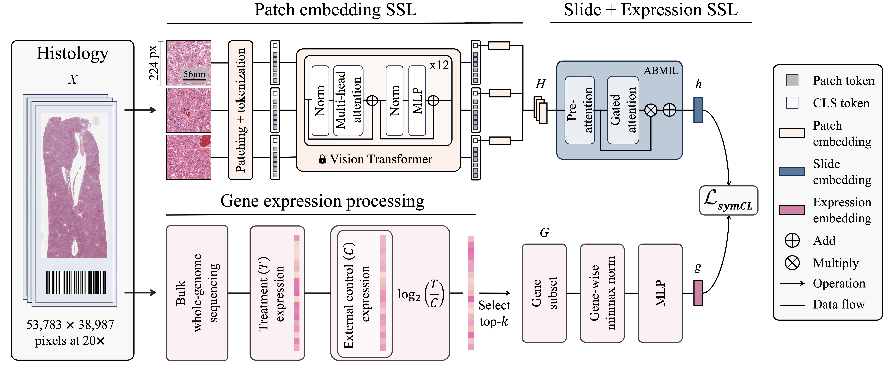

# Code for Transcriptomics-guided Slide Representation Learning in Computational Pathology

Welcome to the official GitHub repository for our CVPR 2024 paper, "Transcriptomics-guided Slide Representation Learning in Computational Pathology". This project was developed by the Mahmood Lab at Harvard Medical School and Brigham and Women's Hospital. 



## Highlights
This work introduces the first method for slide representation learning using multimodal pretraining. Slide representation learning defines a new class of self-supervised methods that aim at extracting information-rich embeddings of hisotlogy whole-slide images, without using explicit supervision (such as cancer subtype or cancer grade). In this work, we introduce TANGLE, a methods for Slide + Expression (S+E) pretraining. Conceptually, this method follows the CLIP principle widely employed in Vision-Language model. 

Here, we align the slide with its corresponding gene expression profile. The resulting slide encoder embeds the underlying molecular landscape of the tissue, and, as such, can be used for various downstream tasks. In this work, we focus on morphological subtyping of breast and lung cancer, and morphological lesion detection in pre-clinical drug safety studies.  

## Code
This repository contains the implementation of TANGLE, with step-by-step instructions and data to reproduce results on the TCGA-BRCA (Invasive breast cancer) cohort. 

### Installation

```bash
# Clone repo
git clone https://github.com/mahmoodlab/TANGLE
cd TANGLE

# Create conda env
conda create -n tangle
conda activate tangle
```

### Preprocessing 

This code assumes that you have already pre-processed your dataset.

Preprocessing whole-slide images requires (1) segmenting the tissue, (2) extracting patches, and (3) extracting patch embeddings. In breast and lung cohorts, we train TANGLE using ResNet50 features pretrained on ImageNet and CTransPath. 

- Tissue segmentation, patching and ResNet50 patch embedding extraction can be done using the [CLAM toolbox](https://github.com/mahmoodlab/CLAM).
- CTransPath patch embedding extraction can be done using the [official implementation](https://github.com/Xiyue-Wang/TransPath). 

Preprocessing the corresponding gene expression profile can be done in several ways. For the TCGA cohorts, we used normalized RNA sequencing data available [here](https://xenabrowser.net/datapages/?dataset=TCGA.BRCA.sampleMap%2FHiSeqV2_PANCAN&host=https%3A%2F%2Ftcga.xenahubs.net&removeHub=https%3A%2F%2Fxena.treehouse.gi.ucsc.edu%3A443). A more processed form can be accessed [here](https://github.com/mahmoodlab/SurvPath/blob/main/datasets_csv/raw_rna_data/combine/brca/rna_clean.csv).

### Training on TCGA-BRCA

We provide a link to a Drive that includes (1) TCGA-BRCA CTransPath patch embeddings, (2) the correspondings expression profile, and (3) the morphological subtyping labels. These need to be downloaded and moved to the base directory in a new dir called `data`. Due to patient privacy, we cannot upload the downstream MGB cohort. 

```bash
# Train Tangle
source scripts/launch_tangle_training.sh
```

### Evaluate Tangle

We provide a link to a Drive that includes (1) 3 pretrained checkpoints for Tangle, Tangle-Rec and Intra, and (2) pre-extracted slide embeddings for TCGA-BRCA. In addition, we provide a script for downstream evaluation. Due to patient privacy concerns, we cannot provide the corresponding slide embeddings, but the same script can easily be used for other downstream datasets, such as BRACS, AIDPATH, IMPRESS, BCNB, etc. 

```bash
# Few-shot evaluation
source scripts/launch_tangle_evaluation.sh
```

### Citation

If you find our work useful in your research, please consider citing:
```
@inproceedings{jaume2024transcriptomics,
  title={Transcriptomics-guided Slide Representation Learning in Computational Pathology},
  author={Jaume, Guillaume and Oldenburg, Lukas and Vaidya, Anurag Jayant and Chen, Richard J. and Williamson, Drew FK and Peeters, Thomas and Song, Andrew H. and Mahmood, Faisal},
  booktitle={Proceedings of the IEEE/CVF Conference on Computer Vision and Pattern Recognition (CVPR)},
  year={2024}
}
```

